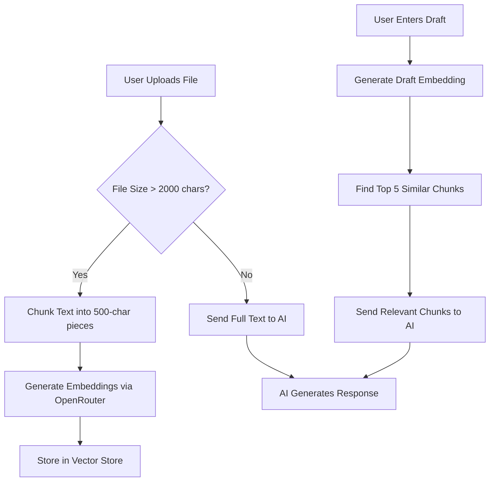

# RAG Implementation Plan for GhostNote

## Overview
Implement Retrieval-Augmented Generation (RAG) using embeddings and vector search for large Brand DNA files. This ensures only relevant chunks are sent to the AI instead of the entire file content.

## Architecture Diagram



## Design Decisions (Cost-Optimized)

| Component | Choice | Rationale |
|-----------|--------|-----------|
| **Storage** | In-memory Map | Zero cost, no Firebase changes, simple to implement |
| **Embedding Model** | `sentence-transformers/all-MiniLM-L6-v2` | Free on OpenRouter, 384 dimensions, good quality |
| **RAG Threshold** | 2000 characters | Balances context window vs. relevance |
| **Chunks Retrieved** | Top 5 | Provides ~2500 chars of relevant context |
| **Chunk Size** | 500 characters | Fits multiple chunks in context window |
| **Chunk Overlap** | 100 characters | Ensures no context loss at boundaries |

## Files to Create

### 1. `api/lib/vectorStore.ts`
In-memory vector store with session-based storage.
- `storeEmbeddings(sessionId, chunks, embeddings)` - Store chunks with embeddings
- `findSimilarChunks(sessionId, queryEmbedding, topK)` - Cosine similarity search
- `clearSession(sessionId)` - Cleanup old sessions

### 2. `api/lib/chunker.ts`
Text chunking utility.
- `chunkText(text, chunkSize, overlap)` - Split text into overlapping chunks
- `estimateTokens(text)` - Rough token estimation

### 3. `api/lib/embeddings.ts`
Embedding service using OpenRouter.
- `generateEmbedding(text)` - Call OpenRouter embedding API
- `generateEmbeddingsBatch(texts)` - Batch embedding for efficiency

### 4. `api/lib/similarity.ts`
Cosine similarity calculation.
- `cosineSimilarity(a, b)` - Calculate similarity between two vectors

## Files to Modify

### 1. `api/generate.ts`
Add RAG flow:
- Accept optional `fileContent` and `sessionId` in request body
- If `fileContent` provided and > 2000 chars:
  1. Chunk the file content
  2. Generate embeddings for chunks
  3. Store in vector store
  4. Generate embedding for draft
  5. Retrieve top 5 similar chunks
  6. Use chunks as reference instead of full text
- If `fileContent` <= 2000 chars: use full text as before

### 2. `components/Dashboard.tsx`
Minimal changes:
- Pass `fileContent` (decoded base64) in API request when using file tab
- Generate a session ID for vector store isolation

## API Request Flow Changes

### Current Flow
```json
{
  "draft": "User's draft text",
  "referenceText": "Full reference text or file content",
  "intensity": 50
}
```

### New Flow (with RAG)
```json
{
  "draft": "User's draft text",
  "referenceText": "Full reference text (for small files)",
  "fileContent": "Full file content (for large files, will be chunked)",
  "sessionId": "unique-session-id",
  "intensity": 50
}
```

## Backward Compatibility
- If `fileContent` is not provided, behavior remains exactly the same
- If file is small (< 2000 chars), full text is used (no RAG overhead)
- Existing text-based references work unchanged

## Security Considerations
- Session isolation prevents cross-user data leakage
- In-memory store clears on server restart (acceptable for MVP)
- Input sanitization already exists in api/generate.ts

## Cost Analysis
- **Embedding API**: Free (using sentence-transformers model)
- **Storage**: Free (in-memory)
- **Compute**: Minimal (cosine similarity is fast)
- **Total Additional Cost**: $0

## Implementation Phases

### Phase 1: Core Utilities
1. Create chunker.ts
2. Create similarity.ts
3. Create embeddings.ts
4. Create vectorStore.ts

### Phase 2: API Integration
1. Modify api/generate.ts to support RAG
2. Add file content handling

### Phase 3: Frontend Integration
1. Update Dashboard.tsx to pass file content
2. Generate session IDs

### Phase 4: Testing
1. Test with small files (no RAG)
2. Test with large files (RAG activated)
3. Verify backward compatibility

## Success Criteria
- [ ] Files under 2000 chars work exactly as before
- [ ] Files over 2000 chars trigger RAG flow
- [ ] AI receives only relevant chunks, not full file
- [ ] Response quality maintained or improved
- [ ] No breaking changes to existing functionality
